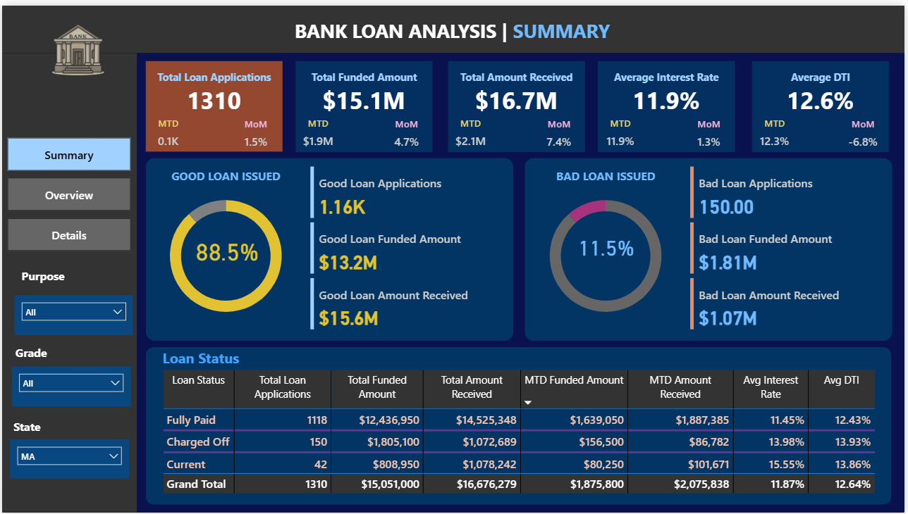
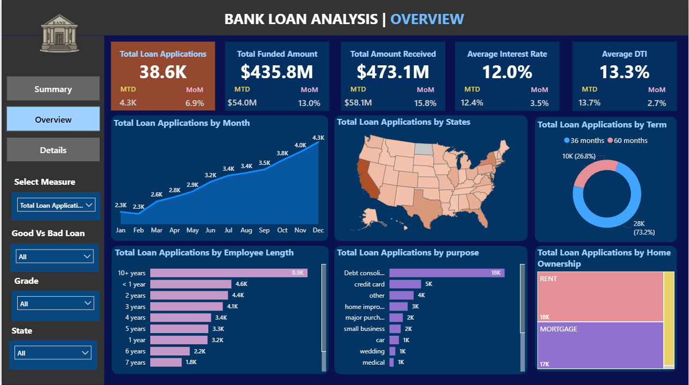
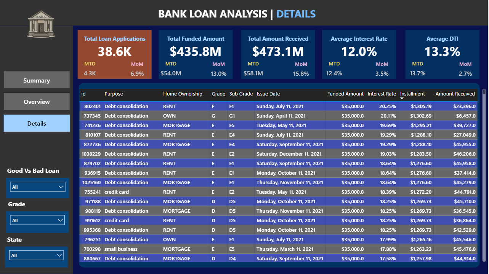

# 📊 Bank Loan Analysis

A complete end-to-end analytics project using **SQL + Power BI** to analyze financial lending performance, borrower risk, and loan quality across the United States.

---

## 📝 Project Overview

This project analyzes **38,000+ bank loan applications** to uncover insights on:

- ✔️ Loan funding & repayment performance  
- ✔️ Borrower characteristics affecting defaults  
- ✔️ Good vs Bad loan segmentation  
- ✔️ State-wise & month-wise loan distribution  
- ✔️ Operational KPIs such as Interest Rate, DTI, MTD/MoM trends  

The Power BI dashboard contains **three pages**:

1. **Summary** – High-level KPIs  
2. **Overview** – Trends & demographic insights  
3. **Details** – Record-level loan explorer  

---

## 📂 Dataset

**Source:** Kaggle  
🔗 https://www.kaggle.com/datasets/datawitharyan/financial-loan-dataset

### Dataset Fields

| Column Name      | Description                                 |
|------------------|---------------------------------------------|
| id               | Unique loan identifier                       |
| loan_amount      | Funded loan amount                           |
| total_payment    | Amount received                              |
| int_rate         | Interest rate (%)                            |
| dti              | Debt-to-income ratio                         |
| loan_status      | Fully Paid / Current / Charged Off           |
| issue_date       | Loan issue date                              |
| address_state    | Borrower’s state                             |
| emp_length       | Employment length                             |
| purpose          | Purpose of loan                              |
| home_ownership   | RENT / OWN / MORTGAGE                        |

---

## 🛠️ Tech Stack

- **SQL Server** – Data cleaning, transformations, KPI logic  
- **Power BI** – Dashboard creation, visuals, DAX measures  
- **DAX** – MTD, PMTD, YoY calculations  
- **Excel/CSV** – Dataset manipulation  

---

## 📘 SQL Files Used in This Project

### 🔹 Summary KPIs SQL  
 
Includes queries for:

- Total Loan Applications  
- MTD / PMTD metrics  
- Total Funded Amount  
- Total Amount Received  
- Avg Interest Rate  
- Avg DTI  
- Good vs Bad Loan KPIs  
- Loan Status Grid  

---

### 🔹 Overview SQL  

Includes analysis on:

- Monthly Loan Trends  
- State-wise Applications  
- Loan Terms (36 vs 60 months)  
- Employee Length  
- Loan Purpose  
- Home Ownership  

---

## 📊 Dashboard Preview

### 🟦 Summary Page

**Highlights:**

- **Total Loan Applications:** 1310  
- **Total Funded Amount:** $15.1M  
- **Total Amount Received:** $16.7M  
- **Good Loan Issued:** 88.5%  
- **Bad Loan Issued:** 11.5%  

---

### 🟩 Overview Page

Includes:

- Monthly Trend  
- State-wise Heat Map  
- Loan Applications by Term  
- Employment Length  
- Loan Purpose  
- Home Ownership  

---

### 🟧 Details Page

Record-level drill-down view, including:

- Purpose  
- Home Ownership  
- Grade / Sub-Grade  
- Interest Rate  
- Installments  
- Amount Received  

---

## 📈 Key Insights From Analysis

### ✔️ **Good Loan Performance is Strong**
- 88.5% loans are **Fully Paid** or **Current**  
- Good Loans contribute **$15.6M+** in repayments  

### ✔️ **Bad Loan Ratio = 11.5%**
- 150 Charged Off loans  
- Bad Loan Funded Amount = **$1.81M**

### ✔️ **Seasonality Observed**
- Strong growth from Feb → Dec  
- December peak: **4.3K applications**

### ✔️ **Top Loan Purposes**
- **Debt Consolidation (18K+)**  
- Credit Card  
- Home Improvement  

### ✔️ **Top Loan States**
- CA, TX, FL, NY  

### ✔️ **Loan Terms**
- 73% → 36 months  
- 27% → 60 months  

### ✔️ **Interest Rate & DTI**
- Average Interest Rate = **12%**  
- Average DTI = **13.3%**

---

